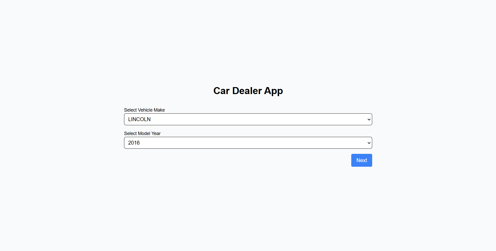
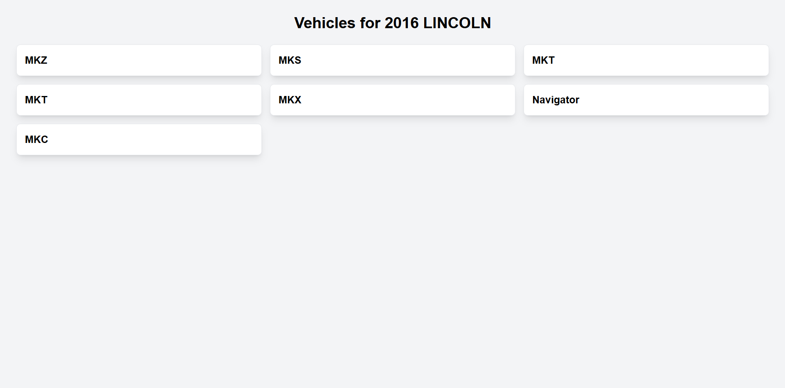

# Car Dealer App

## Overview
This is a car dealer app built with Next.js. It allows users to view vehicles based on make and year, providing detailed information about different models available for sale. The app fetches data from the National Highway Traffic Safety Administration (NHTSA) API.

## Features
- Browse vehicles by make and model year.
- Display a list of available cars with relevant details.
- Responsive design for mobile and desktop users.
- Data fetched dynamically using Next.js static generation.

## Installation

To get started, clone the repository and install the dependencies:

```bash
git clone https://github.com/yourusername/car-dealer-app.git
cd car-dealer-app
npm install
```


## Available Scripts

In the project directory, you can run the following commands:

Starts the development server:
```bash
npm start or yarn start
``` 
Builds the app for production to the build folder:
```bash
npm run build or yarn build
```
Runs ESLint to check for any code issues:
```bash 
npm run lint or yarn lint
```
Runs Prettier to format the codebase:
```bash
npm run format or yarn format
```

## Screenshots

Here is a screenshot of the app running:



